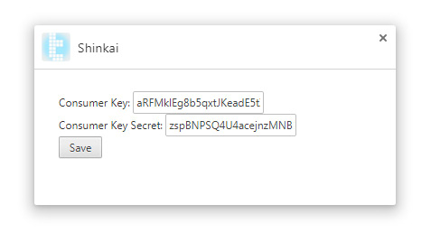
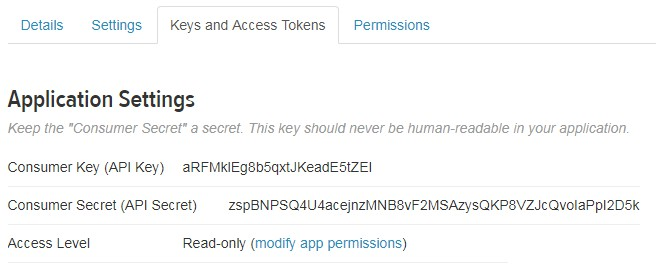

# Shinkai doc

## API key の設定

Shinkai の使用には Twitter API キーが必要です。APIキーを取得するには下記の手順で新規にTwitterアプリケーションを登録すればいいのですが、
正しく手続きを完了させるには`Twitterアカウントの設定`の`モバイル`に携帯電話番号を登録しておく必要があります。

### Twitter Application の登録

- Twitterにログイン
- https://apps.twitter.com/ にアクセス
- `Create New App` を押す
- Application Details を埋める
  - `Name` : 適当に分かりやすい名前を入力。既に使われている名前は使用できないことに注意
  - `Description` : 適当に10文字以上入力
  - `Website` : 適当に入力。 (例：`http://placeholder.com/`)
  - `Callback URL` : 適当に入力。(例：`http://localhost/`) 当アプリでは本来は記入の必要は無いのですが、Twitterのバグにより入力しておく必要があります
- Developer Agreement の `Yes, I have read and agree to the Twitter Developer Agreement.` にチェックを入れて
  `Create your Twitter application` を押す
- 正常に完了した場合は https://apps.twitter.com/ に先程入力したアプリ名のリンクが追加されている

### Permission の設定

当アプリは Read only 権限のみで動作します。セキュリティのために必ずアプリの権限を設定してください。

- https://apps.twitter.com/ から先程作成したアプリ名をクリック
- `Permissions` をクリック
- `Read only` をクリックし `Update Settings` を押して完了

### API key の取得と拡張機能への登録

- https://apps.twitter.com/ から先程作成したアプリ名をクリック
- `Keys and Access Tokens`をクリック
- `Application Settings` にある `Consumer Key (API Key)` 及び `Consumer Secret (API Secret)` の2つが目的のAPIキーとなります
- 拡張機能の Shinkai のオプションを開き、 `Consumer Key:` 及び `Consumer Secret:` に先程の値を入力し Save ボタンを押して登録完了

