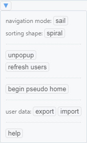

# Shinkai doc - 各機能

## メニュー

- `clawl` : フォロー中ユーザーのツイートの新着チェックを行います。`auto clawl enabled` 表示中は一定時間ごとに自動でチェックが行われます

- `show home` : ホームタイムラインを表示します

- `cool down` : ユーザーマップ上の新着表示のユーザーを既読表示にします

- `sort mode`
  - `new` : ツイートの新着順に`sorting shape`に従ってユーザーアイコンを配置します
  - `custom` : [カスタムマップ](#ユーザーアイコン)に従ってユーザーアイコンを配置します

- `reset view` : ユーザーマップの表示位置を初期位置に戻します

### サブメニュー

- navigation mode : `sail` / `drag`
  - [ユーザーマップビュー](#ユーザーマップビュー)のマウスドラッグで移動するメソッドを切り替えます

- sorting shape : `spiral` / `wave`

- `unpopup` : ユーザーマップ上の全てのポップアップを消去します

- `refresh users` : [refresh users](#refresh-users)の項を参照

- `begin pseudo home` : 選択中ユーザーがフォローしているユーザをユーザーマップにロードすることで`疑似ホーム`状態になります
  - 疑似ホーム状態で`clawl`を押した場合は表示されているユーザーの中から
    ある種の制限の中で新着チェックが行われることになり、必ずしも最新のツイート順に更新が行われることとはならないので注意。
  - `end pseudo home`を押して終了

- user data
  - `export` : カスタムマップやロードしたユーザー情報等のデータをファイルに保存します
  - `import` : 上で保存したファイルを読み込み、Shinkaiに反映します

<!--
### experimental features

- `show bounded timeline`
 -->

## 初回起動時

初回起動時には自動で `refresh users` が実行されます。あまりにも多くの人数をフォローしている場合は一時的にユーザーのロード処理が不完全な状態で止まります。
詳しくは[refresh users](#refresh-users)の項を参照してください。

## ユーザーマップビュー

ユーザーマップ上にマウスカーソルがある状態で`マウスドラッグ`することによりビューの移動ができます。
また`マウスホイールスクロール`でズームイン/アウトができます。

マウスドラッグによる移動方式は `sail`/`drag` の2種類があり、サブメニューから切り替えることができます。
`Ctrl+マウスドラッグ`、もしくは`マウス右ボタンドラッグ`で選択中のものとは別の移動方式を使うことができます。

## ユーザーアイコン

ユーザーマップ上のユーザーアイコンをクリックすることでそのユーザーのタイムラインを表示します。

またアイコンドラッグで移動、`sort mode` が `custom` の場合にはそのユーザーアイコンの位置の変更が記憶されます。(カスタムマップ)

## refresh users

現在のアカウントのフォローしているユーザー情報を更新します。新たにユーザーをフォロー/リムーブした場合に押すとShinkai内で反映されます。

あまりにも多くの人数をフォローしている場合、Twitter API制限のために処理を一時停止することがあります。その際はしばらく時間をおいてから再び当該ボタンを押してください。

## Twitter API 制限 (Rate limit exceeded) について

ユーザー情報の取得やホームタイムラインの取得といった Twitter API の利用にはいくつかの制限が付されており、
特に一定時間ごとに何回までそれを使用できるかという `Rate limit` が時折問題となります。
基本的には数十分待つことで解決することが殆どなので、ある機能の実行中にこのエラーに遭遇した場合は、しばらく時間を置いてから再びその機能の呼び出しを行ってみてください。

## その他

- このアプリはTwitterクライアントでなくTwitterビューアであり、見る専用です。このアプリを通してツイートする機能はありません。

- パフォーマンス上の観点から、現時点でこのアプリが快適に使えるフォロー人数は多くて500人程度、限界で2000人程だと思います。
  数千・数万人をフォローしている場合、動作がとてつもなく重くなる恐れがあるので注意してください。

