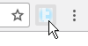
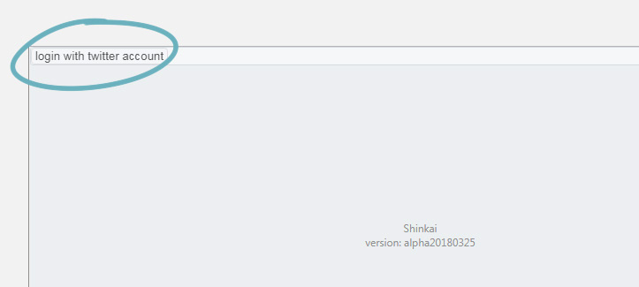
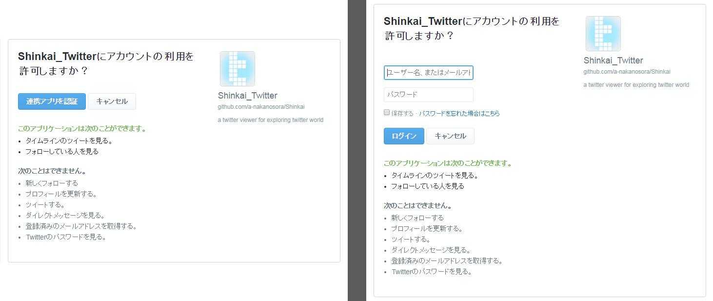
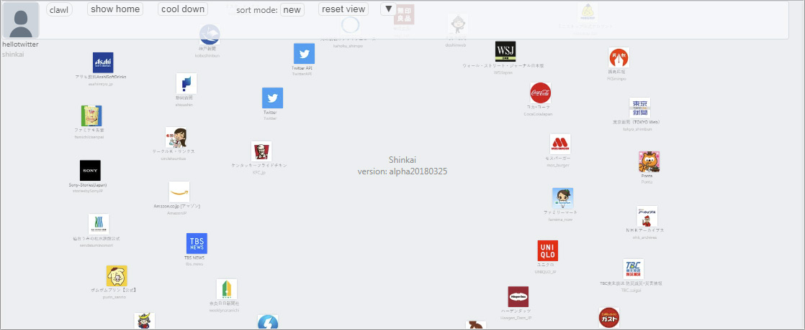
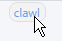
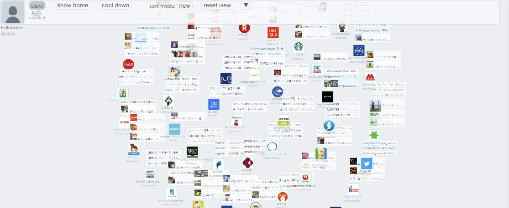
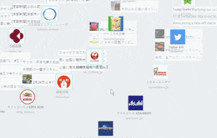
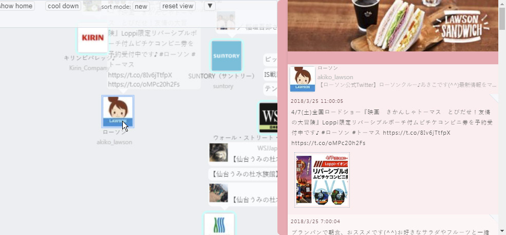
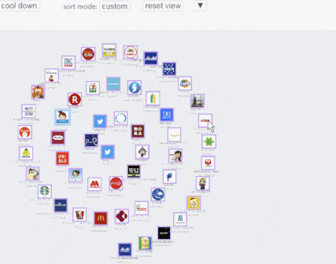
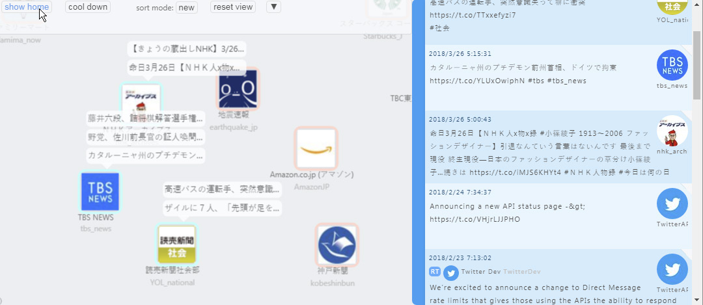

# Shinkai doc - 大まかな使い方

## ログイン

ShinkaiアイコンをクリックしてShinkaiを起動します。

左上のログインボタンを押します。

アプリケーションの承認画面が表示されるので、提携ボタンを押してください。(Twitterにログインしていない場合は右の画面になるのでログイン情報を入力。)   
念の為、ここでアプリケーションの権限が「ツイートを見る」「フォローしている人を見る」の2つだけ(すなわちRead-only)であることを確認してください。

ログインが完了すると左上に自分のアイコンと名前が表示されます。  
また初回起動時にはフォロー中ユーザーのロード処理が入りますが、場合によっては時間がかかることがあります。その際は処理が完了するまでしばらくお待ち下さい。

## 新着チェック

メニューの`clawl`ボタンを押すことで新着チェックが行われます。

新着チェックが完了すると、ユーザーマップ上の新着ツイートのあるユーザーのアイコンの上にその内容のポップアップが表示されます。

## ユーザーマップビュー

### ビューの移動・ズーム

ユーザーアイコンが並ぶユーザーマップ上でマウスドラッグを行うと表示位置を移動できます。
またマウスホイールスクロールでズームイン/アウトができます。

### ユーザータイムライン

ユーザーアイコンクリックでそのユーザーのタイムラインを表示します。

### カスタムマップ

ユーザーアイコンをドラッグでアイコン位置を移動します。
`sort mode`が`custom`の状態でアイコンを移動した場合、その位置が保存・復元されるようになります。

## ホームタイムライン

`show home`ボタンを押すことで自身のホームタイムラインを表示できます。

---

他は[各機能](./ops.md)参照

